# EPAM_Project
Проект сторений у рамках IT-марафону компанії EPAM.

Тематикою проекту є електронна черга для запису до лікаря.

Проект розміщений на хмарному сервісі AWS за посиланням http://52.90.105.113/.

Опис сторінок та файлів виконаних у рамках проекту:

1) 404.php - сторінка, що відображається у тому випадку, коли шукана сторінка не знайдена.
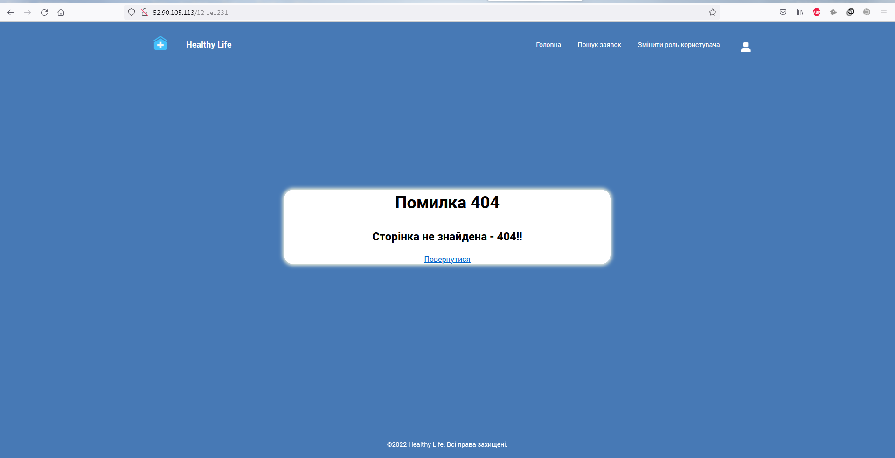 
2) closedStatus.php - сторінка з інформуванням про успішність закриття заявки оператором чи адміністратором (не доступна звичайним та неавторизованим  користувачам).
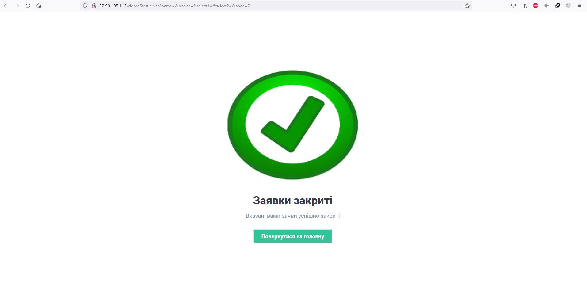 
3) exit.php - вихід користувачів з системи.
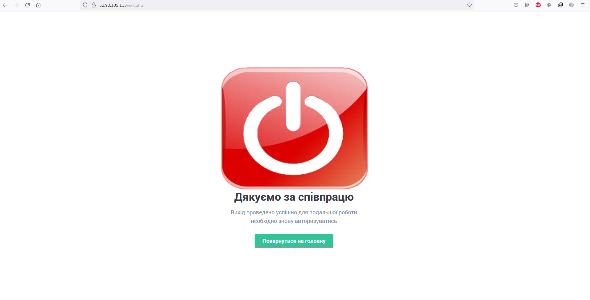 
4) history.php - перегляд заявок у системі, можливість їх фільтрації та відправки переглянутих заявок у обробку (останнє тільки для адміністраторів та операторів).
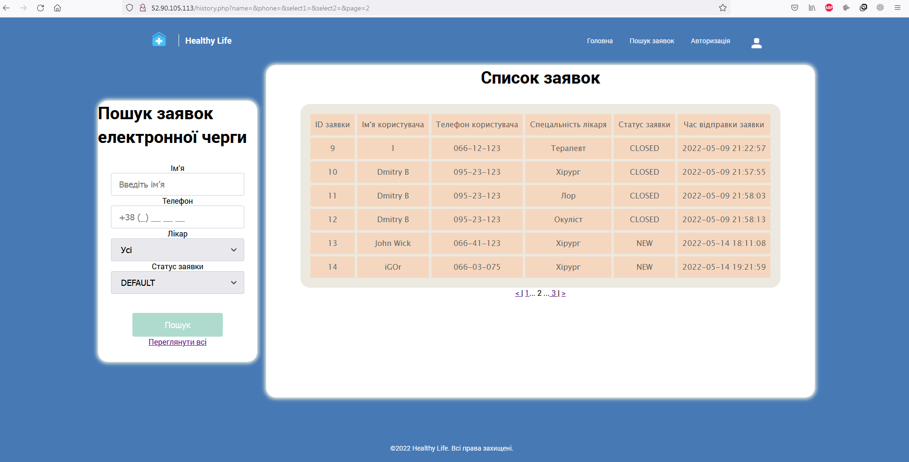 
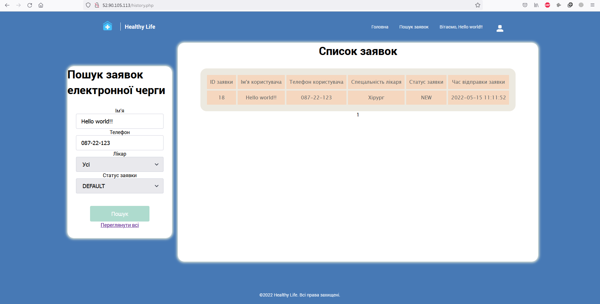 
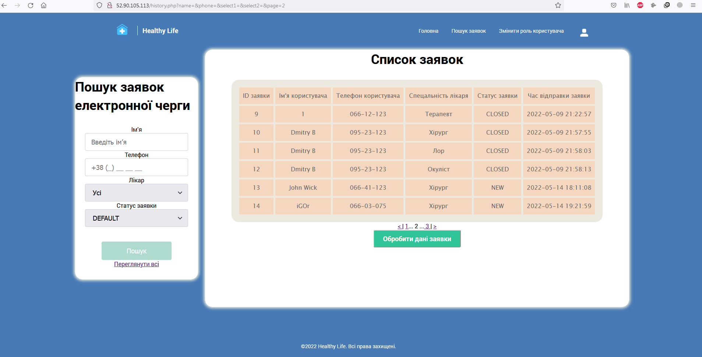 
5) index.php - головна сторінка на якій можуть ввести свої дані для відправлення заявки як авторизовані клієнти так і не авторизовані.
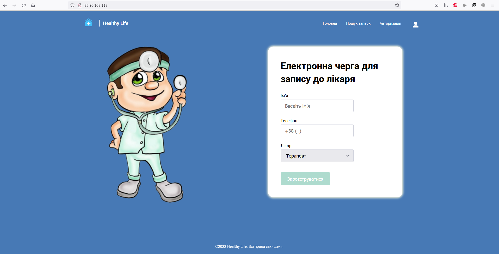 
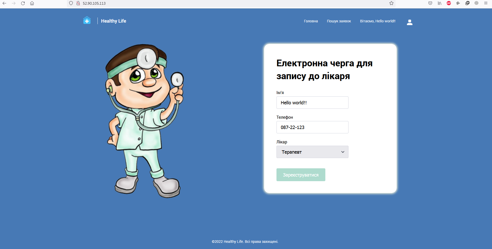 
6) panel.php - сторінка для вибору користувача, якому буде підвищена або понижена роль у системі (доступна тільки адміністраторам ресурсу).
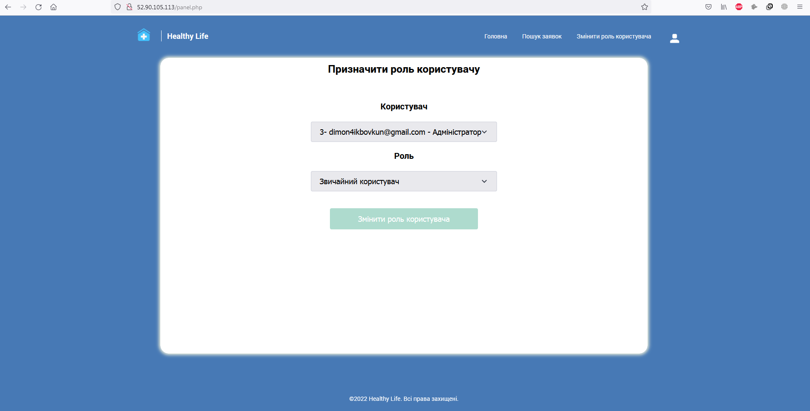 
7) requestStatus.php - сторінка з інформуванням про успішність відправлення заявки у обробку оператором чи адміністратором системи та можливістю закриття заявки (не доступна звичайним та неавторизованим  користувачам).
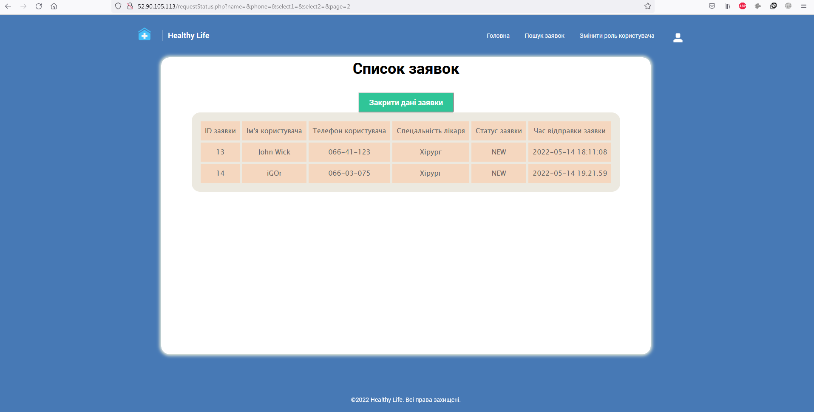
8) role-change.php - сторінка для інформуванням успішності зміни ролі користувача системи адміністратором.
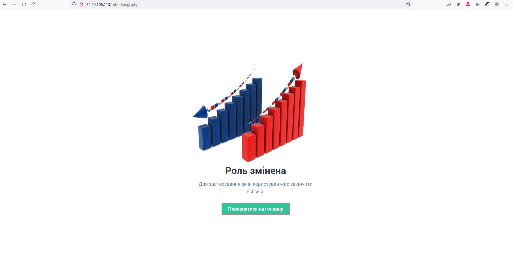
9) success.php - сторінка з інформуванням про успішність відправки заявки у обробку.

11) /scripts/reg/reg.php - сторінка з перевіркою форми авторизації та занесенню відповідних даних до бази.
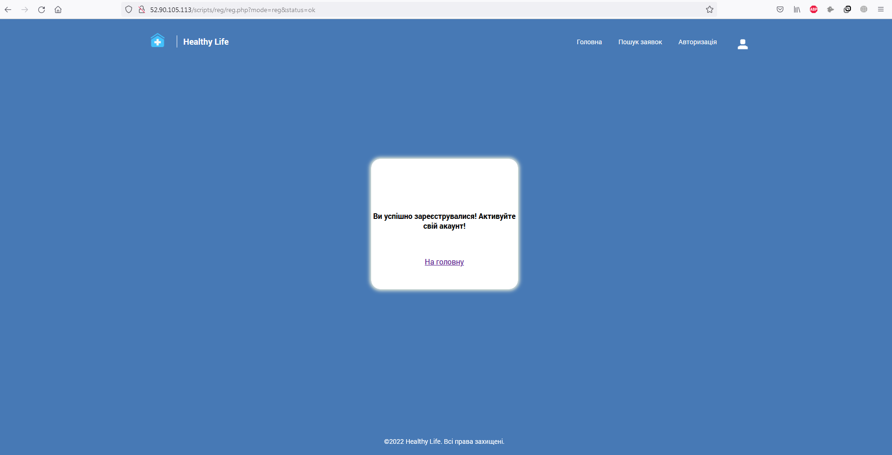
12) /scripts/reg/reg-form.php - сторінка з формою для реєстрації користувачів.
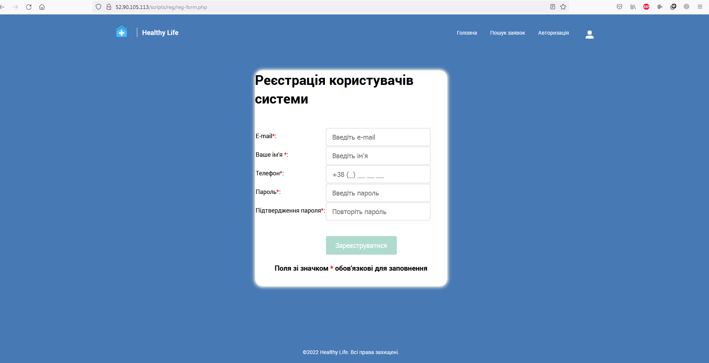
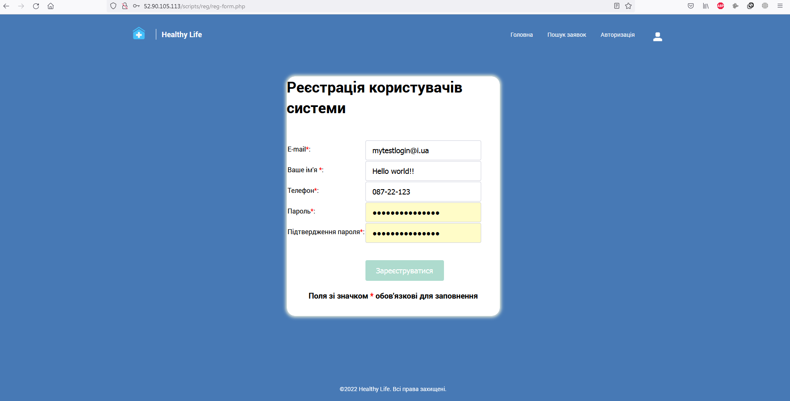
13) /scripts/auth/auth.php - сторінка з перевіркою форми авторизації та при відповідності даних входу у систему.
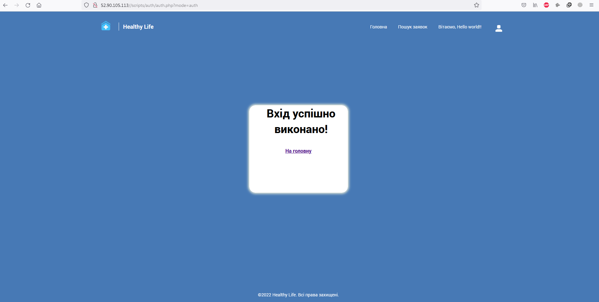
14) /scripts/auth/auth_form.php - сторінка з формою для авторизації користувачів.
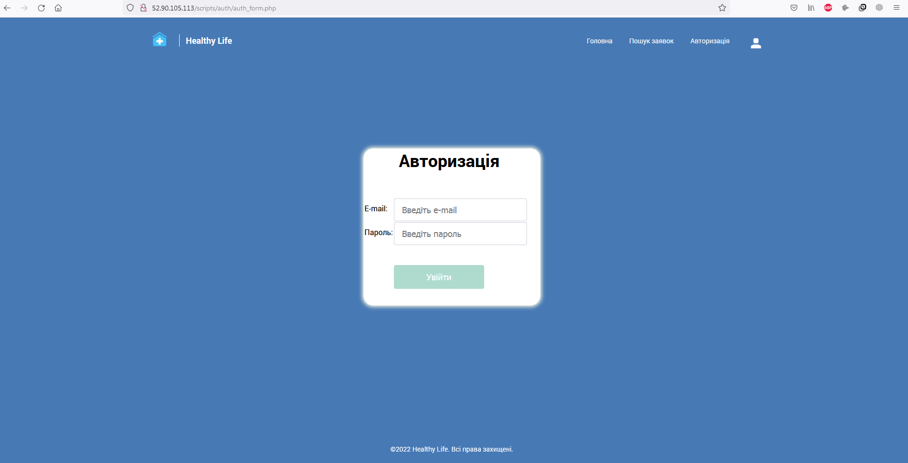
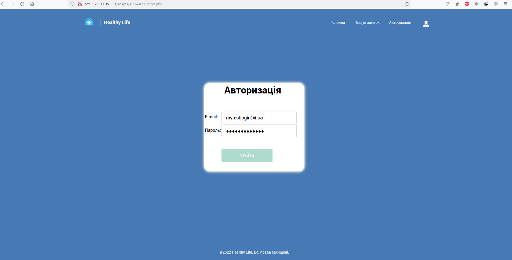
15) config.php - файл, що зберігає основні змінні, що визначають основні параметри роботи додатку.
16) script.js - файл, що зберігає команди js, що використовуються у проекті.
17) /style/style.css - головний файл css стилів, що були використані у проекті.
18) /scripts/bd/bd.php - php файл, що зберігає параметри підключення до бази даних.
19) /scripts/func/funct.php - php файл, що зберігає функції, що застосовувалися у проекті.
20) /Assets/ - папка для графічних файлів, що використовувалися у пректі.
21) epamproject.sql - файл сценарію створення бази даних.
